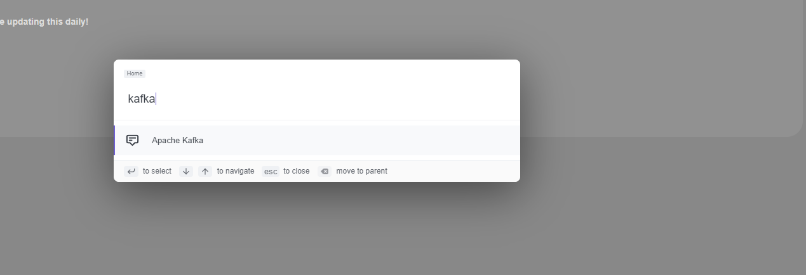

# 🍢AlphaBar browser command bar for tab search and web shortcuts
Run by `CMD+K` or `CTRL+K` hotkeys on any page, easy switch to an open tab or run a shortcut

Made with ReactJS, Redux, Webext-Redux, and Ninja-Keys

### How to run / edit?
This is a react app, so clone repo, and `yarn build`.
Drag your build folder into your chrome/edge extensions page to install
Hit Control+K to open the command bar on any site.

### Todo
  - Fix icons
  - Add more actions
  - Cleanup scrollbar styles
  - Parse keywords from tab URLS
  - Cleanup unused artifacts from create-react-app
